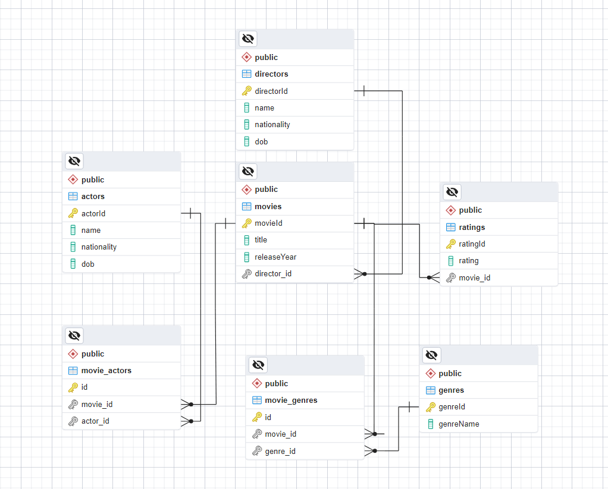

# PostgreSQL Database Project

## Overview

This project involves setting up a PostgreSQL database to manage information about movies, including directors, actors, genres, and ratings. The database schema includes tables for Directors, Actors, Genres, Ratings, Movies, and a many-to-many relationship table, MovieGenres. 

## Database Schema

### Directors Table
- **DirectorID** (Primary Key, SERIAL)
- **Name** (VARCHAR(100))
- **Nationality** (VARCHAR(50))
- **DOB** (DATE)

### Actors Table
- **ActorID** (Primary Key, SERIAL)
- **Name** (VARCHAR(100))
- **Nationality** (VARCHAR(50))
- **DOB** (DATE)

### Genres Table
- **GenreID** (Primary Key, SERIAL)
- **GenreName** (VARCHAR(50))

### Movies Table
- **MovieID** (Primary Key, SERIAL)
- **Title** (VARCHAR(100))
- **ReleaseYear** (INT)
- **DirectorID** (INT, Foreign Key referencing DirectorID in the Directors table)

### Ratings Table
- **MovieID** (Primary Key, INT, Foreign Key referencing MovieID in the Movies table)
- **Rating** (INT)

### MovieGenres Table
- **MovieID** (INT, Foreign Key referencing MovieID in the Movies table)
- **GenreID** (INT, Foreign Key referencing GenreID in the Genres table)

### MovieActors Table
- **MovieID** (INT, Foreign Key referencing MovieID in the Movies table)
- **ActorID** (INT, Foreign Key referencing ActorID in the Actors table)

## Setup and Installation
* Clone the Repository:
```bash
git clone https://github.com/DavXYZ/movies-db.git
```
### Install Dependencies:

```bash
npm install
```

## Assignments

### 1. Create the Database
1. Set up the database and define the tables as specified.
2. Create the `MovieGenres` table to handle the many-to-many relationship between Movies and Genres.
3. Update the .env file with your PostgreSQL credentials.
4. Run the migration script to generate migrations and set up the schema:
```bash
npm run migration:generate src/migrations/yourMigrationName
npm run migration:run
```
If you want revert run this command
```bash
npm run migration:revert src/migrations/yourMigrationName
```
5. For droping tables use this command
```bash
npm run migration:drop
```

### 2. Populate Tables
1. Add at least 5 entries to each table (Directors, Actors, Genres, Movies, Ratings, and the MovieGenres,MovieActors bridge tables).
 ```bash
 npm run seed
 ```

## Run code use one of this commands

1. 
```bash
npm run build
npm start
```
2.
```bash
npm run dev
```

### 3. CRUD Operations
1. Implement Create, Read, Update, and Delete operations for the following tables:
   - **Directors**
   - **Actors**
   - **Genres**
   - **Movies**
   - **Ratings**
2. For the `MovieGenres` table, implement only Create and Delete operations.
3. For the `MovieActors` table, implement only Create and Delete operations.

## Database Diagram



## Routing
- The application uses Express.js for routing. Below are the available routes and their functionality:

### Movies Routes (/movies)

* GET /: Retrieve all movies.
* GET /:id: Retrieve a movie by its ID.
* POST /: Add a new movie.
* PUT /:id: Update a movie by its ID.
* DELETE /:id: Delete a movie by its ID.

### Actors Routes (/actors)

* GET /: Retrieve all actors.
* GET /:id: Retrieve an actor by its ID.
* POST /: Add a new actor.
* PUT /:id: Update an actor by its ID.
* DELETE /:id: Delete an actor by its ID.

### Genres Routes (/genres)

* GET /: Retrieve all genres.
* GET /:id: Retrieve a genre by its ID.
* POST /: Add a new genre.
* PUT /:id: Update a genre by its ID.
* DELETE /:id: Delete a genre by its ID.

### Directors Routes (/directors)
 
* GET /: Retrieve all directors.
* GET /:id: Retrieve a director by its ID.
* POST /: Add a new director.
* PUT /:id: Update a director by its ID.
* DELETE /:id: Delete a director by its ID.

### Ratings Routes (/ratings)

* GET /: Retrieve all ratings.
* GET /:movieId: Retrieve a rating by movie ID.
* POST /: Add a new rating.
* PUT /:movieId: Update a rating by movie ID.
* DELETE /:movieId: Delete a rating by movie ID

### MovieGenres Routes (/movie-genres)

* POST /: Add a new movie-genre association.
* DELETE /: Remove a movie-genre association.

### MovieGenres Routes (/movie-actor)

* POST /: Add a new movie-actor association.
* DELETE /: Remove a movie-actor association.